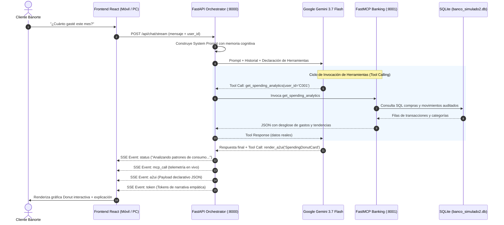

# Arquitectura Integral: Banorte Conversational Banking & A2UI
**HackMTY 2026 · Equipo Llamas 2026 · Reto Banorte**

Este documento detalla la arquitectura de extremo a extremo del sistema bancario conversacional con Inteligencia Artificial Agéntica, interfaces dinámicas A2UI y servidor bancario FastMCP.

---

## 1. Visión y Propósito
El proyecto transforma la banca móvil tradicional en una **experiencia agéntica viva**:
1. **Maya (Copiloto Financiero)**: Un agente con inteligencia emocional y razonamiento bancario profesional potenciado por **Google Gemini 3.7 Flash**.
2. **A2UI (Agent-to-User Interface)**: La interfaz gráfica no es estática; el agente genera, renderiza y reordena componentes y widgets interactivos en tiempo real según la conversación.
3. **Seguridad Normativa (2FA / Banxico)**: Protección estricta de transferencias SPEI y convenios de reestructuración de deuda mediante Token Móvil interactivo (Circular 14/2017).
4. **Memoria Cognitiva Persistente**: Perfil del usuario, registro de fricciones y personalización en base de datos SQLite.

---

## 2. Separación de Responsabilidades por Personas

```
┌─────────────────────────────────────────────────────────────────────────┐
│                           ARQUITECTURA POR PERSONAS                     │
├────────────────────────────────┬────────────────────────────────────────┤
│ Persona 1: Core Bancario & MCP │ Persona 2: Componentes React A2UI      │
│ • SQLite: banco_simulado2.db   │ • SpendingDonutCard, FinancialHealth   │
│ • FastMCP en localhost:8001    │ • SpeiTransferForm, InvestmentSim      │
│ • Herramientas y analíticas    │ • DynamicA2UIRegistry & Contratos JSON │
├────────────────────────────────┼────────────────────────────────────────┤
│ Persona 3: Orquestador Gemini  │ Persona 4: Frontend Shell & Routing    │
│ • FastAPI Backend (:8000)      │ • MobileSimulator (Banca Móvil /)      │
│ • Tool-calling loop en vivo    │ • PowerUserDashboard (PC /dashboard)   │
│ • Guardrails de seguridad 2FA  │ • homeWidgetsManager & Sincronización  │
└────────────────────────────────┴────────────────────────────────────────┘
```

---

## 3. Diagrama de Secuencia y Flujo de Datos



---

## 4. Módulos Clave del Sistema

### A. Core Bancario y Servidor FastMCP (`backend/mcp_server_mock.py`)
- **Puerto:** `8001` (transporte FastMCP / SSE).
- **Base de Datos:** SQLite auditada (`backend/banco_simulado2.db`).
- **Herramientas Expuestas:**
  - `get_customer_profile`: Perfil del cliente, tipo de cuenta y segmento.
  - `get_account_balance`: Saldos en cuentas de cheques, ahorro y nómina.
  - `get_user_debt`: Corte de adeudo en tarjetas de crédito e intereses.
  - `get_spending_analytics`: Análisis de gastos por rubro, comercio y mes.
  - `get_historical_income_expense_trend`: Comparativa de ingresos vs egresos.
  - `get_financial_health_score`: Semáforo 360° y capacidad de pago.
  - `simulate_investment`: Simulador de rendimiento en Pagaré Banorte.
  - `prepare_spei_transfer` y `execute_spei_transfer`: Flujo SPEI seguro.
  - `manage_home_widgets`: Gestión de la pantalla de inicio del cliente.

### B. Orquestador Gemini (`backend/app/gemini_orchestrator.py`)
- **Modelo:** `gemini-3.7-flash` mediante el SDK oficial `google-genai`.
- **System Prompt Equilibrado:** Combina empatía de asesora bancaria preferente con rigor operativo (cero alucinaciones).
- **Bucle Agéntico (Multi-turn Tool Calling):** Resuelve hasta 5 turnos de herramientas encadenadas por petición.
- **Normalización de Payloads:** Garantiza que los componentes visuales reciban props con nombres uniformes y tipos válidos.

### C. Registro y Catálogo A2UI (`frontend/src/components/`)
- **`DynamicA2UIRegistry.tsx`**: Renderizador dinámico por nombre de componente.
- Componentes principales:
  - **`SpendingDonutCard.tsx`**: Gráfica de dona SVG con desglose de categorías y barras de progreso.
  - **`FinancialHealthGauge.tsx`**: Semáforo visual de salud financiera y uso de crédito.
  - **`DebtRestructureCard.tsx`**: Comparador de 3 planes de congelamiento de deuda.
  - **`InvestmentSimulatorCard.tsx`**: Sliders en tiempo real para simular plazos y montos en Pagaré.
  - **`SpeiTransferFormCard.tsx`**: Formulario interactivo con contactos frecuentes de un toque.
  - **`BanorteChartCard.tsx`**: Gráficas de barras, líneas y diagramas Sankey de flujo de efectivo.

### D. Experiencia de Usuario Adaptativa y Enrutamiento Inteligente
- **Móvil (`/`)**: Carga `MobileSimulator.tsx`, diseñado mobile-first con tarjetas deslizables y widgets configurables.
- **PC / Escritorio (`/dashboard`)**: Redirección automática a `PowerUserDashboard.tsx`, con Command Center, telemetría FastMCP y dock expandible de Maya.

---

## 5. Protocolo de Seguridad y Token Móvil (2FA)
- Toda transacción monetaria (SPEI) o contractual (convenio de deuda) requiere autenticación de doble factor.
- **Guardrail Agéntico:** Gemini tiene prohibido procesar autorizaciones basadas en texto plano en el chat.
- El usuario **debe presionar físicamente** el botón interactivo *"Autorizar con Token Móvil"* en la tarjeta A2UI para despachar la acción autenticada.

---

## 6. Despliegue en Google Cloud Run
- **Dockerfile Multi-stage**:
  1. *Stage 1 (Node 22)*: Compila el frontend React con TypeScript y Vite.
  2. *Stage 2 (Python 3.11)*: Instala dependencias y copia el backend, la base SQLite y los activos estáticos compilados.
- **`entrypoint.sh`**: Inicia FastMCP en segundo plano (`:8001`) y el servidor FastAPI en el puerto de Cloud Run (`$PORT`).
- Un solo contenedor sirve tanto las APIs REST/SSE como la SPA web en producción con HTTPS automático.
